# LTE and 5G Scenarios Simulation with Omnet++
## Summary

This project focus itself in generating solutions for randomly allocated antennas in an antenna placement problem.

The algorigthms present use the solutions to also create Omnet++ configurations and then running the related simulations in order to test the found solutions.

For the used algorithms, we adapted two prominent meta-heuristics from literature to align with our unique disaster-response constraints:

- Grey Wolf Optimizer (GWO)
- Genetic Algorithm (GA)


---

### Main pipeline (run_all.py)

The main entry point orchestrates: **user generation → movement simulation (OMNeT++) → solver (ILP/GA/GWO) → config generation → network simulation (OMNeT++) → CSV export**. One process per seed; within each seed, one process per (mode, min_sinr).

```mermaid
flowchart LR
    subgraph Config["Config"]
        SEEDS["chosen_seeds"]
        MODES["modes\n(single, fixed, varying, ga, pgwo2)"]
        MIN_SINRS["min_sinrs\n(5, 10, 15 dB)"]
        MAP["size_x, size_y, size_sector, n_macros"]
    end

    subgraph Step1["1. User & movement"]
        POISSON["gen_users_t_m\n(Poisson)"]
        UE_SLICE["ues_per_slice"]
        MOVE_INI["ilp_move_users\n(.ini)"]
        OMNET_MOVE["OMNeT++\nmovement run"]
        SNAPSHOT[".sna\n(UE positions)"]
    end

    subgraph Step2["2. Solver"]
        MAP_CHESS["MapChess\nscenario"]
        SINR_MAP["getSinrMap()"]
        USERS_T_M["get_map_ues_time\n(users_t_m)"]
        SOLVER["ILP / GA / GWO"]
        RESULT_TXT["result_*.txt\n(eNB placement)"]
    end

    subgraph Step3["3. Sim config & run"]
        ILP_INI["ilp_sliced_ini\n(or per_slice)"]
        ILP_NED["ilp_ned\n(.ned)"]
        OMNET_SIM["OMNeT++\nsimulation"]
        SCAVETOOL["scavetool → CSV"]
    end

    Config --> POISSON
    POISSON --> UE_SLICE
    UE_SLICE --> MOVE_INI
    MOVE_INI --> OMNET_MOVE
    OMNET_MOVE --> SNAPSHOT
    SNAPSHOT --> MAP_CHESS
    MAP_CHESS --> SINR_MAP
    SNAPSHOT --> USERS_T_M
    SINR_MAP --> SOLVER
    USERS_T_M --> SOLVER
    SOLVER --> RESULT_TXT
    RESULT_TXT --> ILP_INI
    ILP_INI --> ILP_NED
    ILP_NED --> OMNET_SIM
    OMNET_SIM --> SCAVETOOL
```



---

### Data flow summary

```
Config (seeds, modes, min_sinrs, map, micro_power, ...)
    ↓
Poisson users & ues_per_slice (helpers.general_functions)
    ↓
Movement .ini (scenarios.five_g.ilp_move_users) → OMNeT++ → .sna
    ↓
MapChess + getSinrMap() (core) + get_map_ues_time (helpers.helper_xml from .sna)
    ↓
Solver (solvers.ilp / ga / gwo) → result_<mode>_<min_sinr>.txt
    ↓
Simulation .ini (ilp_sliced_ini*) + .ned (ilp_ned)
    ↓
OMNeT++ simulation → .sca / .vec
    ↓
scavetool → CSV → viz (graphs, comp_comput_performance)
```

---

### File artefacts

| Artefact | Producer | Consumer / use |
|----------|----------|-----------------|
| `ilp_move_users-<seed>.ini` | ilp_move_users | OMNeT++ (movement) |
| `ilp_move_users-<seed>.sna` | OMNeT++ | get_map_ues_time, gen_ilp_info |
| `result_<mode>_<min_sinr>.txt` | Solvers | ilp_sliced_ini*, ilp_ned |
| `ilp_<mode>_sliced_<min_sinr>.ini` | ilp_sliced_ini* | OMNeT++ (video/app) |
| `*.ned` | ilp_ned | OMNeT++ network definition |
| `*.sca`, `*.vec` | OMNeT++ | scavetool → CSV |
| CSV | get_csv (scavetool) | viz.graphs, comp_comput_performance |

---

### Usage example:

[run_all.py](/Functions/run_all.py) (main)

### Complexity analysis

Can be found in details in the [SOLVERS_GA_GWO.md](/docs/SOLVERS_GA_GWO.md) file.

## Versions
**Operational Systems:** Lubuntu 18.04 and Ubuntu 18.04.5

**Omnet++:** 5.6.2

**INET-Framework:** 4.2.2

**SimuLTE:** 1.2.0

**Simu5G:** 1.1.0

## Authors

@GiordanoSM
@julianobp
