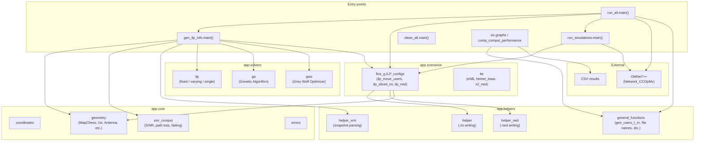
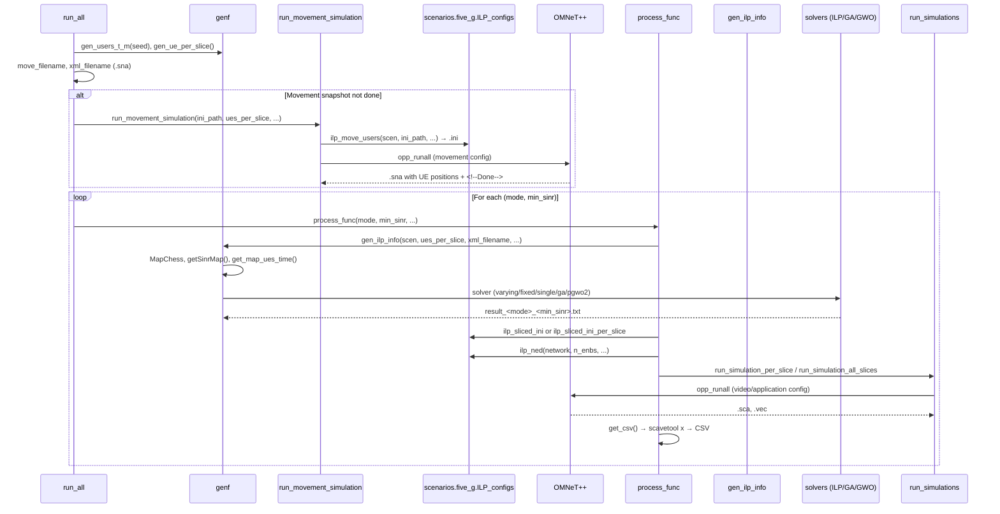

# LTE/5G Scenarios Simulation — Code Behaviour Overview

This document describes how the application works as a whole: entry points, data flow, and interactions between components.

---

## 1. High-level architecture



---

## 2. Main pipeline (run_all)

The main entry point orchestrates: **user generation → movement simulation (OMNeT++) → solver (ILP/GA/GWO) → config generation → network simulation (OMNeT++) → CSV export**. One process per seed; within each seed, one process per (mode, min_sinr).

```mermaid
flowchart LR
    subgraph Config["Config"]
        SEEDS["chosen_seeds"]
        MODES["modes\n(single, fixed, varying, ga, pgwo2)"]
        MIN_SINRS["min_sinrs\n(5, 10, 15 dB)"]
        MAP["size_x, size_y, size_sector, n_macros"]
    end

    subgraph Step1["1. User & movement"]
        POISSON["gen_users_t_m\n(Poisson)"]
        UE_SLICE["ues_per_slice"]
        MOVE_INI["ilp_move_users\n(.ini)"]
        OMNET_MOVE["OMNeT++\nmovement run"]
        SNAPSHOT[".sna\n(UE positions)"]
    end

    subgraph Step2["2. Solver"]
        MAP_CHESS["MapChess\nscenario"]
        SINR_MAP["getSinrMap()"]
        USERS_T_M["get_map_ues_time\n(users_t_m)"]
        SOLVER["ILP / GA / GWO"]
        RESULT_TXT["result_*.txt\n(eNB placement)"]
    end

    subgraph Step3["3. Sim config & run"]
        ILP_INI["ilp_sliced_ini\n(or per_slice)"]
        ILP_NED["ilp_ned\n(.ned)"]
        OMNET_SIM["OMNeT++\nsimulation"]
        SCAVETOOL["scavetool → CSV"]
    end

    Config --> POISSON
    POISSON --> UE_SLICE
    UE_SLICE --> MOVE_INI
    MOVE_INI --> OMNET_MOVE
    OMNET_MOVE --> SNAPSHOT
    SNAPSHOT --> MAP_CHESS
    MAP_CHESS --> SINR_MAP
    SNAPSHOT --> USERS_T_M
    SINR_MAP --> SOLVER
    USERS_T_M --> SOLVER
    SOLVER --> RESULT_TXT
    RESULT_TXT --> ILP_INI
    ILP_INI --> ILP_NED
    ILP_NED --> OMNET_SIM
    OMNET_SIM --> SCAVETOOL
```



---

## 3. Sequence: one seed, one (mode, min_sinr)



---

## 4. Component roles

| Component | Role |
|----------|------|
| **app.core** | Coordinates, map geometry (MapChess, sectors, Ue, Antenna), SINR/path-loss/fading, and error types. MapChess holds sectors, SINR map, and UE placement. |
| **app.helpers** | Generate file names, Poisson user counts, UE-per-slice indices; write .ini (helper), .ned (helper_ned); parse snapshot XML (helper_xml). |
| **app.solvers** | **ILP** (fixed / varying / single) and heuristics **GA**, **GWO** decide eNB placement per slice from SINR map, users_t_m, and constraints. Output: result_&lt;mode&gt;_&lt;min_sinr&gt;.txt. See [SOLVERS_GA_GWO.md](SOLVERS_GA_GWO.md) for pseudocode and computational complexity (GA: O(T·G·P·M²), GWO: O(T·D·I·W·M²)). |
| **app.scenarios.five_g** | **ILP_configs**: ilp_move_users (movement .ini), ilp_sliced_ini / ilp_sliced_ini_per_slice (simulation .ini from solver results), ilp_ned (network .ned). |
| **app.scenarios.lte** | LTE-specific helpers (eNB2, hetnet_base, x2_ned) for LTE scenarios. |
| **gen_ilp_info** | Builds MapChess, SINR map, users_t_m from snapshot; calls the chosen solver (ILP/GA/GWO) and writes solver result file. |
| **run_simulations** | run_make (compile OMNeT++), run_simulation_per_slice / run_simulation_all_slices (execute OMNeT++). |
| **run_all** | Top-level: run_make, then per-seed run_all (movement → gen_ilp_info for each mode/min_sinr → configs → simulations → get_csv). |
| **app.viz** | graphs, comp_comput_performance: read CSV/results and produce plots or performance comparisons. |

---

## 5. Data flow summary

```
Config (seeds, modes, min_sinrs, map, micro_power, ...)
    ↓
Poisson users & ues_per_slice (helpers.general_functions)
    ↓
Movement .ini (scenarios.five_g.ilp_move_users) → OMNeT++ → .sna
    ↓
MapChess + getSinrMap() (core) + get_map_ues_time (helpers.helper_xml from .sna)
    ↓
Solver (solvers.ilp / ga / gwo) → result_<mode>_<min_sinr>.txt
    ↓
Simulation .ini (ilp_sliced_ini*) + .ned (ilp_ned)
    ↓
OMNeT++ simulation → .sca / .vec
    ↓
scavetool → CSV → viz (graphs, comp_comput_performance)
```

---

## 6. File artefacts

| Artefact | Producer | Consumer / use |
|----------|----------|-----------------|
| `ilp_move_users-<seed>.ini` | ilp_move_users | OMNeT++ (movement) |
| `ilp_move_users-<seed>.sna` | OMNeT++ | get_map_ues_time, gen_ilp_info |
| `result_<mode>_<min_sinr>.txt` | Solvers | ilp_sliced_ini*, ilp_ned |
| `ilp_<mode>_sliced_<min_sinr>.ini` | ilp_sliced_ini* | OMNeT++ (video/app) |
| `*.ned` | ilp_ned | OMNeT++ network definition |
| `*.sca`, `*.vec` | OMNeT++ | scavetool → CSV |
| CSV | get_csv (scavetool) | viz.graphs, comp_comput_performance |

---

## 7. Object-oriented groupings

Related logic is grouped into classes where appropriate; existing function APIs are kept and delegate to these classes.

| Class | Location | Role |
|-------|----------|------|
| **SimulationPaths** | `app.helpers.general_functions` | Path and filename generation: `get_frameworks_path`, `gen_file_name`, `gen_log_file_name`, `gen_sliced_config_pattern`, `gen_solver_result_filename`, `gen_movement_filename`, `gen_csv_path`. |
| **UserTrafficGenerator** | `app.helpers.general_functions` | User/traffic generation: `verify_modes`, `gen_users_t_m`, `gen_ue_per_slice`, `gen_first_antenna_region`. |
| **MovementSimulationRunner** | `app.gen_ilp_info` | Movement simulation: build scenario, write movement .ini, run OMNeT++, produce .sna. `run_movement_simulation(...)` delegates to `MovementSimulationRunner(...).run()`. |
| **SolverRunner** | `app.gen_ilp_info` | Single (mode, min_sinr) solver run: build SINR map, users_t_m, invoke ILP/GA/GWO, write result file. `gen_ilp_info(...)` delegates to `SolverRunner(...).run()`. |
| **SimulationPipeline** | `app.run_all` | Full pipeline: holds config (seeds, modes, paths, etc.) and runs movement → solvers → configs → simulations → CSV. `main()` builds a `SimulationPipeline` and calls `pipeline.run()`. |

Usage examples:

- **Pipeline:** `pipeline = SimulationPipeline(chosen_seeds=[2, 6], modes=['fixed'], only_solver=True); pipeline.run()`
- **Paths:** `paths = SimulationPaths(); paths.gen_solver_result_filename(result_dir, 'fixed', 5)`
- **Traffic:** `traffic = UserTrafficGenerator(); users_t_m = traffic.gen_users_t_m(seed, lambda_poisson, num_slices)`
- **Solver:** `SolverRunner(scen, ues_per_slice, xml_filename, min_sinr, result_dir, mode, ...).run()`
- **Movement:** `MovementSimulationRunner(ini_path, chosen_seed, size_x, size_y, ...).run()`

This diagram and the sections above describe the code behaviour as a whole: entry points, main pipeline, sequence per (seed, mode, min_sinr), component roles, file artefacts, and OOP groupings.
